# Maphy Automation Testing Processes

This guide provides a detailed breakdown of the automation testing suite implemented for the Maphy application. It covers what each test file focuses on, the logic behind each validation process, key assertions, and how to use these files to understand the system's test coverage.

---

## 📂 Testing Directory Structure

The automation tests are located in `automation_tests/specs/` and categorized into three main folders:
1. **Smoke Tests (`smoke/`)**: Sanity checks to ensure the API and UI render and respond correctly under normal scenarios.
2. **Regression & Security Tests (`regression/`)**: Hardening verifications checking API boundaries, SQLi/XSS prevention, JWT security, and access controls.
3. **Workflow & CRUD Tests (`other/`)**: End-to-end verification of business workflows (Assets, Licenses, Components, Helpdesk, and Settings CRUD).

```mermaid
graph TD
    A[automation_tests/specs] --> B[smoke/]
    A --> C[regression/]
    A --> D[other/]

    B --> B1[project_api_failed_endpoints.spec.js]
    B --> B2[project_api_smoke.spec.js]
    B --> B3[project_pages_smoke.spec.js]

    C --> C1[security_api.spec.js]
    C --> C2[security_auth_jwt.spec.js]
    C --> C3[security_authorization_access_control.spec.js]
    C --> C4[security_discovery_scope.spec.js]
    C --> C5[security_graphql_business_logic.spec.js]
    C --> C6[security_input_parameter.spec.js]
    C --> C7[security_logging_monitoring.spec.js]
    C --> C8[security_misconfig_data_error.spec.js]
    C --> C9[security_ui.spec.js]

    D --> D1[workflow_form_validation.spec.js]
    D --> D2[workflow_helpdesk_reports_users.spec.js]
    D --> D3[workflow_inventory.spec.js]
    D --> D4[workflow_settings_crud.spec.js]
```



---

## 🛠️ Shared Helpers & Utilities

Before diving into the spec files, these support modules under `automation_tests/helpers/` facilitate common testing operations:

* **[driver_helper.js](file:///c:/Office%20Folder/Projects/Maphy/automation_tests/helpers/driver_helper.js)**: Configures headless browser automation (via Selenium WebDriver) and handles actions like login, click events, and input field entry.
* **[jwt_helper.js](file:///c:/Office%20Folder/Projects/Maphy/automation_tests/helpers/jwt_helper.js)**: Encodes and decodes JSON Web Tokens; manipulates signatures (`alg:none`), expiration timestamps (`exp`), and payloads to test authentication security.
* **[project_inventory.js](file:///c:/Office%20Folder/Projects/Maphy/automation_tests/helpers/project_inventory.js)**: Scans the codebase to dynamically find all active backend Express routes and frontend React Router endpoints.
* **[security_helper.js](file:///c:/Office%20Folder/Projects/Maphy/automation_tests/helpers/security_helper.js)**: Handles API endpoint lookup, credentials, and custom assertions (e.g. asserting access is denied or ensuring no server 500 error occurred).
* **[workflow_helper.js](file:///c:/Office%20Folder/Projects/Maphy/automation_tests/helpers/workflow_helper.js)**: Wraps HTTP actions for clean CRUD workflow calls (Create, Update, Delete) and handles multipart form data for file uploads.

---

## 🟢 1. Smoke Testing Suite (`specs/smoke/`)

### 📄 [project_api_failed_endpoints.spec.js](file:///c:/Office%20Folder/Projects/Maphy/automation_tests/specs/smoke/project_api_failed_endpoints.spec.js)
* **Goal**: Verifies that previously failing backend routes are resolved and working correctly.
* **Process**:
  1. Authenticates using valid credentials to obtain a Bearer token.
  2. Loops through a static array of historically problematic endpoints (e.g. `/customFieldsets/selectList`, `/dashboard/chart/tickets`, `/kits/models`, etc.).
  3. Sends a `GET` request to each endpoint using basic pagination query parameters (`limit: 5`, `offset: 0`, `page: 1`).
* **Assertions**:
  * Response status is successful (does not return 500 Internal Server Error).
  * Request is not rejected with a `401 Unauthorized` or `403 Forbidden` response.

---

### 📄 [project_api_smoke.spec.js](file:///c:/Office%20Folder/Projects/Maphy/automation_tests/specs/smoke/project_api_smoke.spec.js)
* **Goal**: Maps and validates the availability of the entire backend REST API surface.
* **Process**:
  1. Calls `discoverApiEndpoints()` and `discoverMountedRouteFiles()` to dynamically parse backend files.
  2. Attempts to log in with invalid credentials to test base authentication rejection.
  3. Sends `GET` requests to all discovered endpoints requiring authorization.
  4. Sends anonymous `GET` requests to a subset (every 4th) of these endpoints to ensure they are blocked.
* **Assertions**:
  * More than 20 server modules are mounted (e.g. users, hardware, accessories).
  * More than 100 endpoints are mapped with valid HTTP methods.
  * Rejects wrong login details.
  * All authorized endpoints return successful states when using a valid token, and reject requests when anonymous.

---

### 📄 [project_pages_smoke.spec.js](file:///c:/Office%20Folder/Projects/Maphy/automation_tests/specs/smoke/project_pages_smoke.spec.js)
* **Goal**: Ensures that all user-facing web pages render successfully without React errors.
* **Process**:
  1. Dynamically discovers all React Router web paths configured in the client (>80 pages).
  2. Launches a headless Selenium WebDriver browser session.
  3. Iterates through all public pages directly.
  4. Performs a login step to store the authentication token (`maphytoken`) in the browser's `localStorage`.
  5. Navigates to every protected page (such as `/Dashboard`, `/assets`, `/peoples`, etc.).
* **Assertions**:
  * Checks that no page redirects back to the login route once authenticated.
  * Ensures that page bodies are not blank.
  * Confirms the DOM does not contain common JavaScript crash symptoms (e.g., "cannot read properties", "undefined is not an object", "failed to compile").

---

## 🔴 2. Regression & Security Testing Suite (`specs/regression/`)

### 📄 [security_api.spec.js](file:///c:/Office%20Folder/Projects/Maphy/automation_tests/specs/regression/security_api.spec.js)
* **Goal**: Regression checks for API authorization boundaries, data leakage, and query parameter safety.
* **Process**:
  * **Auth Boundary Checks**: Queries protected endpoints anonymously, with malformed headers, or with a loopback agent token. Tries logging in using SQL Injection (SQLi) payloads.
  * **Query Parameter Probing**: Passes SQLi payloads into `search` fields on searchable tables. Passes unsafe characters into the `sort` parameter on sorting endpoints.
  * **Response Exposure**: Retrieves the users list to check if password fields are visible. Queries non-existent hardware items to check if database error details leak.
  * **High-Risk Endpoints**: Tests `POST /hardware/agent-import` without authorization headers.
* **Assertions**:
  * Unauthorized/tampered requests return `401` or `403`.
  * SQLi searches and unsafe sort strings do not cause server crashes (fails closed or processes safely).
  * No user password hashes or server stack traces are returned in response payloads.

---

### 📄 [security_auth_jwt.spec.js](file:///c:/Office%20Folder/Projects/Maphy/automation_tests/specs/regression/security_auth_jwt.spec.js)
* **Goal**: Tests session safety, token validity, and JWT signature verification.
* **Process**:
  1. Attempts credential guessing (e.g. `admin/example.com`, `admin/password`) and SQLi credentials against `/users/login`.
  2. Decodes a valid JWT payload to verify signature formats.
  3. Probes the `/dashboard` API using:
     - A tampered JWT payload (modified content).
     - An unsigned JWT (`alg:none`).
     - An expired JWT.
     - A token missing the `Bearer` schema prefix.
  4. (Optional) Floods the login API with requests to test brute-force and rate-limit controls.
  5. (Optional) Verifies token cleanup by invoking a logout endpoint and attempting token reuse.
* **Assertions**:
  * Credential guesses fail to issue tokens.
  * Issued tokens utilize `HS256` hashing and have a future `exp` claim.
  * Expired, unsigned, tampered, or non-Bearer tokens return `401` or `403`.
  * Brute-force requests return HTTP status `429 Too Many Requests`.

---

### 📄 [security_authorization_access_control.spec.js](file:///c:/Office%20Folder/Projects/Maphy/automation_tests/specs/regression/security_authorization_access_control.spec.js)
* **Goal**: Validates Broken Object Level Authorization (BOLA/IDOR) and Privilege Escalation defenses.
* **Process**:
  1. Sends anonymous delete operations to users, hardware, and short URLs.
  2. Attempts to execute administrator actions using a default agent token.
  3. (Optional) Log in as a standard user (`TEST_REGULAR_USER_EMAIL`) and attempt to delete an administrative account (Vertical Privilege Escalation).
  4. (Optional) Log in as a standard user and attempt to fetch another tenant's hardware ID (Horizontal Privilege Escalation / BOLA).
  5. Accesses list endpoints to verify administrative-only metadata is filtered.
* **Assertions**:
  * Destructive requests from unauthorized or standard users fail with `401 Unauthorized` or `403 Forbidden`.
  * Regular users cannot read cross-tenant resources.

---

### 📄 [security_discovery_scope.spec.js](file:///c:/Office%20Folder/Projects/Maphy/automation_tests/specs/regression/security_discovery_scope.spec.js)
* **Goal**: Documents testing permissions, parses the API schema, and validates open health endpoints.
* **Process**:
  1. Asserts that the testing environment has permission (`SECURITY_AUTHORIZED=true`).
  2. Validates that the dynamically parsed API list structure has expected attributes (paths, categories, methods).
  3. Triggers helper functions to export the test coverage inventory and checklist in Markdown.
  4. Scans client source directories (`demo_maphy_client/src`) to detect potential unmapped URLs.
  5. Requests `/health` anonymously and scans the response keys.
* **Assertions**:
  * Health status endpoint is open, but does not expose configurations, passwords, or tokens.
  * Dynamic metadata schema matches standard formats (REST API type, GET/POST matching).
  * Report files are successfully generated on the disk.

---

### 📄 [security_graphql_business_logic.spec.js](file:///c:/Office%20Folder/Projects/Maphy/automation_tests/specs/regression/security_graphql_business_logic.spec.js)
* **Goal**: Probes GraphQL schema visibility and prevents business logic boundaries from being bypassed.
* **Process**:
  1. Issues a GraphQL schema introspection POST request to `/graphql` to see if API layouts are exposed.
  2. (Optional) Submits component checkout requests with negative integers (`qty: -10`, `purchase_cost: -999`).
  3. (Optional) Submits out-of-order workflow operations (e.g., checking in an asset that is not currently checked out).
* **Assertions**:
  * Introspection queries return `401`, `403`, or `404` (protected/disabled).
  * Negative amounts and invalid checkout states are rejected by validation layers.

---

### 📄 [security_input_parameter.spec.js](file:///c:/Office%20Folder/Projects/Maphy/automation_tests/specs/regression/security_input_parameter.spec.js)
* **Goal**: Tests system resilience against SQL Injection, NoSQL Injection, XXE, Path Traversal, and Mass Assignment.
* **Process**:
  * **Injection Probing**: Sends custom payloads (from `security_payloads.js`) to search queries on multiple routes.
  * **NoSQL Login**: Passes MongoDB-style object properties in fields to bypass logic.
  * **XXE Verification**: Submits XML documents containing entity declarations pointing to internal files (e.g. `/etc/passwd`).
  * **ID Traversal**: Queries assets with ids like `../1`, `0`, or `1 OR 1=1`.
  * **Sort Parameter Injection**: Passes SQL commands (`DROP TABLE`) into sort options.
  * **Mass Assignment**: Submits administrator keys (`isAdmin`, `role`) on standard ticket creation.
* **Assertions**:
  * Queries and sorting configurations remain safe and do not cause SQL execution errors.
  * XML payloads do not trigger file disclosure (contain no root, daemon, or system labels).
  * Ticket records do not store unauthorized fields.

---

### 📄 [security_logging_monitoring.spec.js](file:///c:/Office%20Folder/Projects/Maphy/automation_tests/specs/regression/security_logging_monitoring.spec.js)
* **Goal**: Ensures that critical security events trigger audit log entries.
* **Process**:
  1. (Optional) Generates a failed login attempt, then queries `/reports/activity` searching for "login".
  2. (Optional) Executes an administrative creation request (like generating a short URL), then queries `/reports/activity` searching for "short" or "create".
* **Assertions**:
  * Verifies that the security actions appear in the audit trail database, matching search strings for logging completeness.

---

### 📄 [security_misconfig_data_error.spec.js](file:///c:/Office%20Folder/Projects/Maphy/automation_tests/specs/regression/security_misconfig_data_error.spec.js)
* **Goal**: Validates security headers, CORS boundaries, error messages, and debug paths.
* **Process**:
  * **Fingerprinting**: Checks if `x-powered-by` is present.
  * **Browser Headers**: Validates presence of `x-content-type-options` and `x-frame-options`.
  * **CORS Boundaries**: Issues preflight OPTIONS requests using an evil Origin header (`https://evil.example.test`).
  * **HTTP Options**: Verifies supported methods.
  * **Sensitive Fields**: Searches responses of list calls for database credentials or plain passwords.
  * **SQL Error Leakage**: Submits malformed SQL IDs (e.g., `%27%20OR%201%3D1`) to see if databases expose syntax/structure details in errors.
  * **Debug Routes**: Queries private developer endpoints (like `/debug`, `/metrics`, `/swagger.json`, `/api-docs`).
* **Assertions**:
  * Framework headers are hidden.
  * CORS does not echo wildcards or arbitrary origins.
  * OPTIONS restricts `TRACE` and `CONNECT` methods.
  * Malformed error pages hide SQL keywords (e.g., MySQL parser error codes, database schemas).
  * Debug routes return `401`, `403`, or `404`.

---

### 📄 [security_ui.spec.js](file:///c:/Office%20Folder/Projects/Maphy/automation_tests/specs/regression/security_ui.spec.js)
* **Goal**: Verifies UI-level access controls and filters out potential Cross-Site Scripting (XSS) vectors.
* **Process**:
  1. Attempts to view `/assets` without logging in to verify redirection.
  2. Injects a JavaScript execution probe (`window.alert`, `window.eval` override) in the browser via Selenium.
  3. Enters XSS payloads into the login email/password fields and clicks submit.
  4. Enters XSS/SQL payloads in the asset search field.
  5. Inputs an HTML image-error script (``) in search, then queries the resulting table rows for dynamic nodes.
* **Assertions**:
  * Redirects to `/Login`.
  * The injected script execution probe confirms that no input payloads were executed in the browser.
  * Searches return `0` executable HTML elements (like `tbody script`, `tbody img[onerror]`, or `tbody svg[onload]`).

---

## 🔵 3. Workflow & CRUD Testing Suite (`specs/other/`)

### 📄 [workflow_form_validation.spec.js](file:///c:/Office%20Folder/Projects/Maphy/automation_tests/specs/other/workflow_form_validation.spec.js)
* **Goal**: Asserts that client-side forms enforce required input fields before submission.
* **Process**:
  1. Navigates to `/login` and clicks submit with empty fields.
  2. Navigates to `/addEditCompany` and clicks submit with empty fields.
* **Assertions**:
  * Asserts that at least 2 visible warning text markers (`.text-danger`) appear on the login page.
  * Asserts that at least 1 warning text element (`.error`, `.text-danger`, or `.invalid-feedback`) appears on the company creation page.
  * Verifies the browser URL does not change (indicating submission was blocked).

---

### 📄 [workflow_helpdesk_reports_users.spec.js](file:///c:/Office%20Folder/Projects/Maphy/automation_tests/specs/other/workflow_helpdesk_reports_users.spec.js)
* **Goal**: Tests the ticketing system lifecycle, report retrieval, and user lifecycle workflows.
* **Process**:
  * **Helpdesk**: Fetches ticket statuses, creates a mock Talent Group, creates a Ticket Issue, creates a Ticket, updates its status to Closed, and verifies it.
  * **Reports**: Iterates through 7 report routes (assets, accessories, licenses, components, consumables, depreciations, activity) with page limits.
  * **User CRUD**: (Optional) Creates a new user with location/group context, updates user metadata, fetches the user's status profile, deletes the user, and cleans up context items.
* **Assertions**:
  * Ticket creation and status update operations return successfully.
  * All report requests complete without 5xx server errors.
  * User records update and delete correctly.

---

### 📄 [workflow_inventory.spec.js](file:///c:/Office%20Folder/Projects/Maphy/automation_tests/specs/other/workflow_inventory.spec.js)
* **Goal**: Exercises the full lifecycle of inventory assets, licenses, components, accessories, consumables, and file imports.
* **Process**:
  1. Sets up temporary dependency data (manufacturers, status labels, locations, companies, categories) to build clean test assets.
  2. Runs separate end-to-end cycles for:
     - **Assets**: Create -> Update -> Checkout (to User) -> Checkin -> Delete.
     - **Licenses**: Create -> Checkout (to User) -> Fetch Seats -> Checkin (via Seat ID) -> Delete.
     - **Accessories**: Create -> Checkout (to User) -> Fetch Pivot ID -> Checkin (via Pivot ID) -> Delete.
     - **Components**: Create -> Checkout (to Asset ID) -> Fetch Pivot ID -> Checkin (via Pivot ID) -> Delete.
     - **Consumables**: Create -> Checkout (to User) -> Delete.
  3. **Bulk Import**: Submits a CSV header string to `/hardware/bulk-upload`.
  4. **Logo Upload**: (Optional) Uploads a mock PNG base64 string to `/firms/uploadLogo`.
* **Assertions**:
  * Verification that checkout status flags return `success: true`.
  * Verifies that seats, components, and accessories track assignees and retrieve valid unique pivot/seat references.
  * Bulk upload returns success status with `0 assets created` (no parsing error).

---

### 📄 [workflow_settings_crud.spec.js](file:///c:/Office%20Folder/Projects/Maphy/automation_tests/specs/other/workflow_settings_crud.spec.js)
* **Goal**: Confirms stable CRUD operations for foundational system settings.
* **Process**:
  1. **Simple CRUD**: Iteratively creates, updates, reads, and deletes basic resources (`/companies`, `/locations`, `/manufacturers`, `/suppliers`, and `/categories`).
  2. **Complex CRUD**: Creates dependencies (Company & Location), fetches a random user ID to act as a manager, creates a `/departments` record, modifies its name, and removes it.
* **Assertions**:
  * Asserts resource creation returns a valid database ID.
  * Asserts updates are stored by checking if a `GET` request retrieves the new name.
  * Asserts cleanup functions delete the resources cleanly.

---

## 🏃 How to Run the Tests

To run these suites, navigate to the `automation_tests` folder and execute the appropriate NPM script:

```bash
# Run the entire test suite
npm run test

# Run security checks and generate HTML reports
npm run test:security:mochawesome

# Run specifically the smoke tests
npm run test:smoke

# Run specifically the workflow tests
npm run test:workflow
```

> [!NOTE]
> Make sure the Express API Server (running on port `4009`) and the React Client (running on port `3000`) are active before running UI or API suites.
