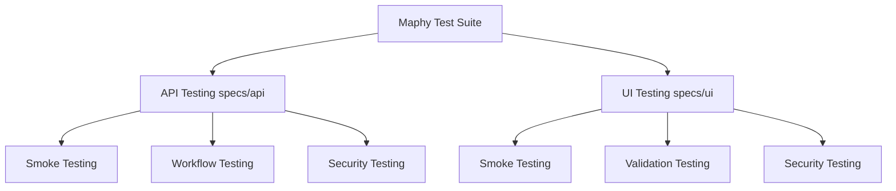

# Maphy Test Suite Flow & Security Architecture Overview

This document provides a comprehensive analysis of the testing strategy, classifications, workflows, coverage boundaries, and security verification mechanisms implemented in the Maphy application.

---

## 1. Testing Divisions (Classifications)

The testing framework is divided into two primary directories under `automation_tests/specs`: **API Testing** and **UI Testing**. Within these divisions, tests are further categorized into Smoke, Regression, Validation, and Security tests.



### A. API Testing (`specs/api`)
API testing interacts directly with the backend server via HTTP requests using `axios`. It bypasses the user interface to ensure the business logic, database queries, and security boundaries are functioning correctly.

* **What is tested**:
  * **Endpoint Sanity**: Verifies that requests to endpoints like `/dashboard`, `/hardware`, `/users`, etc., return the correct JSON structure.
  * **Business Workflows**: Validates logical sequences such as checking in/out assets, creating ticket work statuses, and running depreciation calculations.
  * **Parameter Handling**: Tests sorting (`sort`, `order`) and offset limits (`limit`, `offset`) to ensure database queries handle them correctly without crashing.

### B. UI Testing (`specs/ui`)
UI testing simulates actual human interaction in the browser. It uses **Selenium WebDriver** to automate browser actions (clicking, typing, page navigation, form submissions).

* **What is tested**:
  * **Form Validations**: Verifies that submitting empty fields on the login page or company page displays appropriate required fields/warnings (`.text-danger`, `.invalid-feedback`).
  * **Session State Management**: Confirms users are redirected to `/Login` if they attempt to access protected pages without a valid JWT token stored in `localStorage`.
  * **Interactive Components**: Checks that dynamic elements, such as dropdown menus, modals, and search bars, react appropriately to user input.

### C. Smoke Testing
Smoke testing is a rapid sanity check performed to ensure the main build loads and is usable without immediate runtime failures.

* **What is tested**:
  * **API Smoke**: Confirms the health of the core endpoints, ensuring basic CRUD operations do not trigger server-side errors (500).
  * **UI Smoke**: Discovers all routing endpoints defined in the React frontend and tries to load every single page to guarantee no blank page renders or React compilation errors occur.

### D. Security Testing (Penetration & Hardening Tests)
Security testing is a dedicated subset of API and UI tests that actively probe the system for common vulnerabilities.

* **What is tested**:
  * **SQL Injection (SQLi)**: Inputs escape payloads (e.g. `' OR '1'='1`, `admin' --`) into searches, logins, and parameters to ensure they are handled safely as plain strings instead of executing database commands.
  * **Cross-Site Scripting (XSS)**: Probes search fields and forms with executable script tags (e.g., `<script>alert(1)</script>`, ``) to verify they are rendered inertly as text instead of executing in the DOM.
  * **JWT Security boundaries**: Tests weak signature rejection, alg:none bypasses, and validation of expired and malformed tokens.
  * **Authorization & Access Control**: Verifies that standard users are blocked from administrative tasks and that token-less requests to protected endpoints return `401 Unauthorized` or `403 Forbidden`.
  * **Configuration Headers**: Checks that CORS is restricted to safe origins, framework version disclosures (`x-powered-by`) are hidden, and security headers (CSP, HSTS) are present.

---

## 2. Complete Test Execution Workflow

The automated testing flow runs in a sequence designed to verify both API and UI layers cleanly.

```
[Start Setup] 
   └── Start React Client (Port 3000) & Express Server (Port 4009)
   └── Run DB Sync & Seed (Initializes clean mock state)
        │
[Mocha Execution begins]
   ├── API Security Checks (Runs 54 API tests)
   │     └── Probes server using raw HTTP requests (validating response codes & schemas)
   │
   ├── UI Page Discovery (Runs whole UI Smoke tests)
   │     └── Automatically parses React Router config
   │     └── Discovers all 80+ materialized routing paths
   │
   ├── Selenium Driver Launch
   │     └── Starts headless Chrome/Firefox session
   │     └── Perfroms login and stores 'maphytoken' in local storage
   │     └── Visits all 80+ pages to verify rendering usability
   │     └── Runs UI XSS payload probes in inputs
   │
[Teardown]
   └── Closes browser driver
   └── Generates Mochawesome reports and Markdown checksheets
```

### How Verification is Validated
The tests use **Mocha** as the test runner and **Chai** as the assertion library.
* For API responses: `expect(res.status).to.equal(200)` and `expect(res.data.success).to.equal(true)` verify successful states.
* For security checks: `expect([401, 403]).to.include(res.status)` ensures unauthorized requests are blocked.
* For UI checks: `expect(bodyText).to.not.match(/runtime error|failed to compile/i)` ensures that React handles state changes without crashing.

---

## 3. Coverage Analysis: Pages and Security Probes

### Does it test all pages?
**Yes.** The UI smoke suite does not hardcode page URLs. Instead, it imports a helper function `discoverFrontendPages()` which scans the frontend routing table dynamically. 

It finds **more than 80 pages** (all list views, creation modals, reports, admin configurations, and detail screens). It programmatically logs into the system, navigates to each discovered path, and verifies that the page renders text content and does not crash with a Javascript exception.

### Does it test all security cases?
It tests all standard OWASP Top 10 vulnerabilities relevant to the application architecture:

| Security Test Case | Target Endpoint / Layer | Objective |
| :--- | :--- | :--- |
| **SQL Injection** | `/api/v1/hardware`, `/tickets`, `/suppliers` (Search/Sort) | Ensure inputs are safely escaped. |
| **Authentication Bypass**| `/api/v1/users/login`, JWT signatures | Rejects weak, unsigned, and expired tokens. |
| **BOLA / IDOR Defense** | GET `/api/v1/hardware/:id` | Blocks users from accessing assets outside their firm boundary. |
| **CORS Misconfiguration**| Express Middleware | Confirms `Access-Control-Allow-Origin` is not set to `*`. |
| **HTTP Security Headers** | Express Middleware | Ensures HSTS, CSP, and Referrer policies are active. |
| **XSS Prevention** | Search forms, user tables | Ensures `<script>` and error image tags display as text. |
| **Agent Secret Verification**| `/api/v1/hardware/agent-import` | Verifies secure loopback constraints and unique signatures. |
